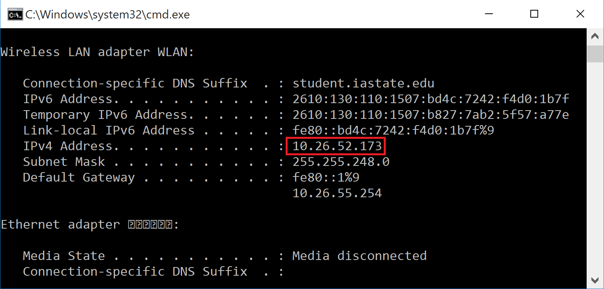

# Deploy

In general there are two ways of sharing Shiny apps: sharing as `R` files and sharing as a webpage.

## Sharing as `R` files

- A copy of your app’s files.
- `runUrl`, `runGitHub`, and `runGist`, for details see `?runUrl`.

Example:

```{r, eval=FALSE}
shiny::runGitHub("rstudio/shiny-examples", subdir = "001-hello")
```

```{block, shareasRnote, type='rmdnote'}
Limitaion of this approach: People who use your app need to setup a similar execution enviroment as you. For example, they need to install `R`, all the packages your app depends on, databases environment for more complicated apps and so on.
```

## Sharing as a webpage

### For temporary uses

Say I have a Shiny app on my desktop in my office and I'll have a meeting in a conference room somewhere in my department. It might be a good choice to host the Shiny app temporarily on my desktop.

1. Find out your IP address. To access your app from other computer, you need to know your IP address. For Windows system, use `ipconfig` command in Command Prompt (`Win`+ R, then input `cmd` and Enter)
. In linux, use `ifcondig` instead. Remember your IP4 Address, for example, mine is `10.26.52.173` as shown in Figure \@ref(fig:ip).

```{r ip, fig.cap='The IP address', echo=FALSE, out.width='70%'}

```

2. Run the following command on the machine hosting the Shiny app. 

```{r, eval=FALSE}
runApp(host = "0.0.0.0", port = 80)
```

```{block, hostnote, type='rmdnote'}
The default value of `host` is `127.0.0.1` (localhost) which means that only the current machine can access it.  To allow other clients to connect, `host` need to be set to `0.0.0.0`.
```

3. Now you can access the Shiny app by typing the IP address in your browser from other machines.

```{block, ipnote, type='rmdnote'}
My IP address starts from `10`, which means it is a private IP, so only people using the same private network as me can access it. Private IP usually have the following ranges:

    192.168.0.0 - 192.168.255.255 (65,536 IP addresses)
    172.16.0.0 - 172.31.255.255 (1,048,576 IP addresses)
    10.0.0.0 - 10.255.255.255 (16,777,216 IP addresses)
    
If your IP is not a private IP, anybody using the Internet may have access to your Shiny app. You may consult the IT department of your organization for details.
```

### For long term uses

- Using [shinyapps.io](http://www.shinyapps.io/), the Rstudio's hosting service for Shiny apps.

- Building your own [Shiny Server](https://www.rstudio.com/products/shiny/shiny-server/).
  - Need a linux server
  - Open source edition (free) and Pro edition (advanced features)
